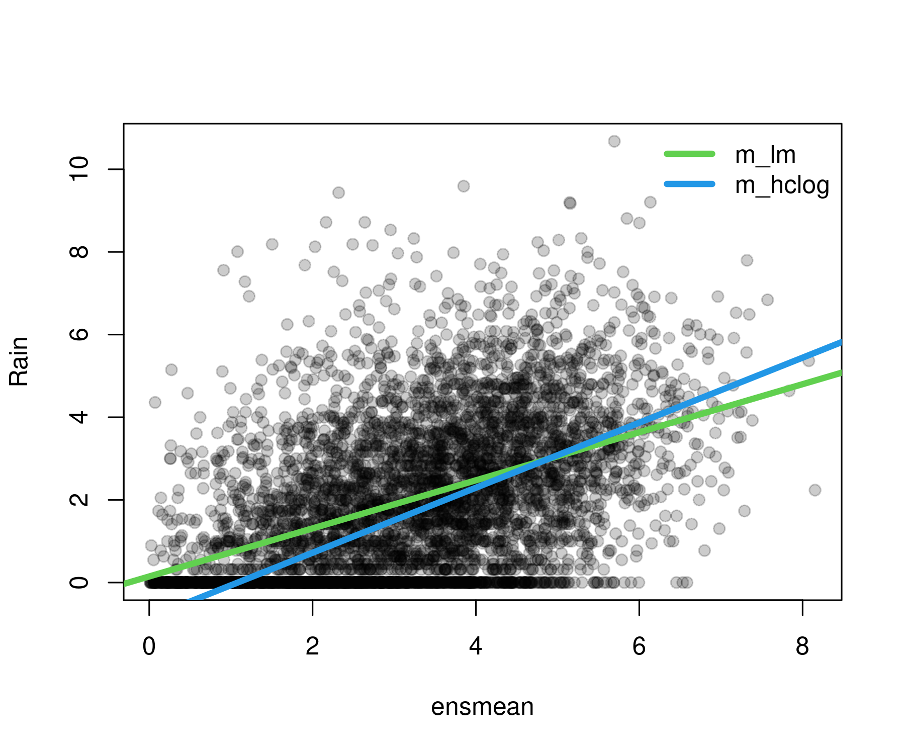

<!-- README.md is generated from README.qmd via: quarto render README.qmd --to gfm -->


# Heteroscedastic Censored and Truncated Regression

## Overview

The R package [crch](https://topmodels.R-Forge.R-project.org/crch/)
provides various regression models for continuous or mixed
discrete-continuous data with right- and/or left-censoring or truncation
of the response. The models use separate linear predictors for the
mean/location and variance/scale parameters and can thus incorporate
heteroscedasticity (conditional on regressors). This has prompted the
package name `crch` (pronounced like *search*) which stands for censored
regression with conditional heteroscedasticity.

A number of different estimation methods can be used:

-   Maximum likelihood estimation.
-   Minimum CRPS estimation.
-   Boosting and stability selection.

The underlying infrastructure for various probability distributions
encompasses:

-   Censored or truncated normal, logistic, and Student-t distributions.
-   Corresponding d/p/q/r functions.
-   `distributions3` objects.

Heteroscedastic extended logistic regression (HXLR) via cumulative link
models for ordinal data, obtained by interval-censoring continuous data,
is also available.

## Installation

The stable version of `crch` is available on
[CRAN](https://CRAN.R-project.org/package=crch):

``` r
install.packages("crch")
```

The latest development version can be installed from
[R-universe](https://zeileis.R-universe.dev/crch):

``` r
install.packages("crch", repos = "https://zeileis.R-universe.dev")
```

## License

The package is available under the [General Public License version
3](https://www.gnu.org/licenses/gpl-3.0.html) or [version
2](https://www.gnu.org/licenses/old-licenses/gpl-2.0.html)

## Illustration

An illustration for censored regression from atmospheric sciences is
rain forecasting. Here, the observed response data are 3 day-accumulated
precipitation amounts over 13 years (2000–2013) at Innsbruck airport.
The covariates are obtained from numerical weather predictions (GEFS
reforecasts). Package and data can be loaded via:

``` r
library("crch")
data("RainIbk", package = "crch")
```

Ensemble mean and standard deviation of the numerical rain forecasts are
used as the regressors for mean and variance of the observations,
respectively.

``` r
RainIbk <- sqrt(RainIbk)
RainIbk$ensmean <- apply(RainIbk[,grep('^rainfc', names(RainIbk))], 1, mean)
RainIbk$enssd <- apply(RainIbk[,grep('^rainfc', names(RainIbk))], 1, sd)
RainIbk <- subset(RainIbk, enssd > 0)
```

Then a classical homoscedastic linear regression is compared with a
heteroscedastic logistic distributional regression, censored at zero to
account for the point mass at zero (i.e., 3-day periods without rain).

``` r
m_lm <- lm(rain ~ ensmean, data = RainIbk)
m_hclog <- crch::crch(rain ~ ensmean | log(enssd), data = RainIbk, left = 0,
  dist = "logistic")
```

Comparing the fitted regression lines shows that the censored model (in
contrast to the classical linear regression) is able to capture a
steeper regression line, i.e., a tighter relationship between rain
forecasts and actual observations.

``` r
plot(rain ~ ensmean, data = RainIbk, pch = 19, ylab = "Rain", col = gray(0, alpha = 0.2))
abline(coef(m_lm)[1:2], col = 3, lwd = 4)
abline(coef(m_hclog)[1:2], col = 4, lwd = 4)
legend("topright", lwd = c(4, 4), lty = c(1, 1), col = c(3, 4),
  c("m_lm", "m_hclog"), bty = "n")
```



The summary output of the censored model shows that not only the mean of
the rain observations but also their standard deviation significantly
depends on the corresponding quantities from the numerical weather
prediction ensemble.

``` r
summary(m_hclog)
## 
## Call:
## crch::crch(formula = rain ~ ensmean | log(enssd), data = RainIbk, dist = "logistic", 
##     left = 0)
## 
## Standardized residuals:
##     Min      1Q  Median      3Q     Max 
## -3.5780 -0.6554  0.1673  1.1189  7.4990 
## 
## Coefficients (location model):
##             Estimate Std. Error z value Pr(>|z|)    
## (Intercept) -0.85266    0.06903  -12.35   <2e-16 ***
## ensmean      0.78686    0.01921   40.97   <2e-16 ***
## 
## Coefficients (scale model with log link):
##             Estimate Std. Error z value Pr(>|z|)    
## (Intercept)  0.11744    0.01460   8.046 8.58e-16 ***
## log(enssd)   0.27055    0.03503   7.723 1.14e-14 ***
## ---
## Signif. codes:  0 '***' 0.001 '**' 0.01 '*' 0.05 '.' 0.1 ' ' 1 
## 
## Distribution: logistic
## Log-likelihood: -8921 on 4 Df
## Number of iterations in BFGS optimization: 15
```
