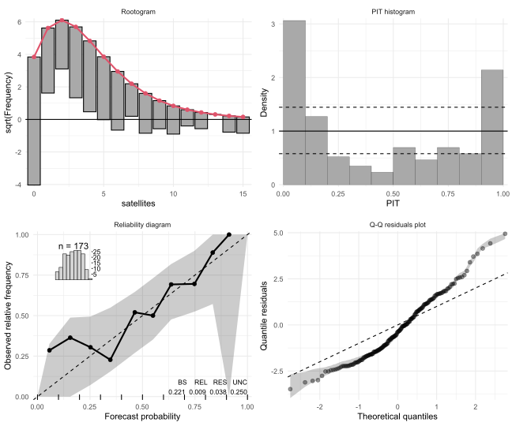

<!-- README.md is generated from README.Rmd. Please edit that file and run rmarkdown::render("README.Rmd") -->
# Infrastructure for Inference and Forecasting in Probabilistic Models 

Unified infrastructure for probabilistic models and distributional regressions: Computations of probabilities, densities, scores, and Hessians. Probabilistic forecasting. Diagnostic graphics such as rootograms, PIT histograms, reliagrams (reliability diagrams), and (randomized) quantile residual Q-Q plots.

Modular object-oriented implementation with support for many model objects, including `lm`, `glm`, `crch`, `disttree`, and more to come.

